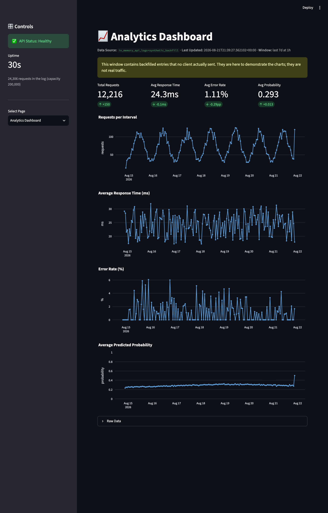
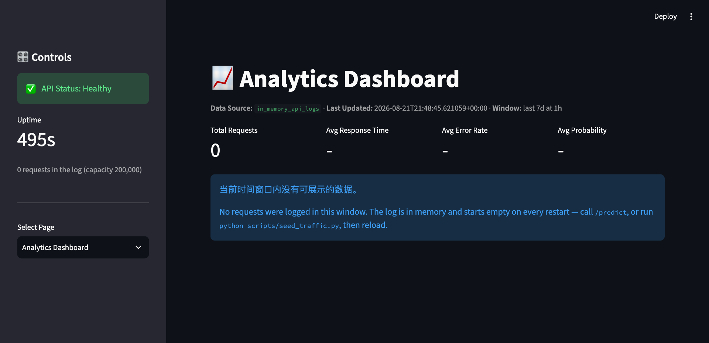
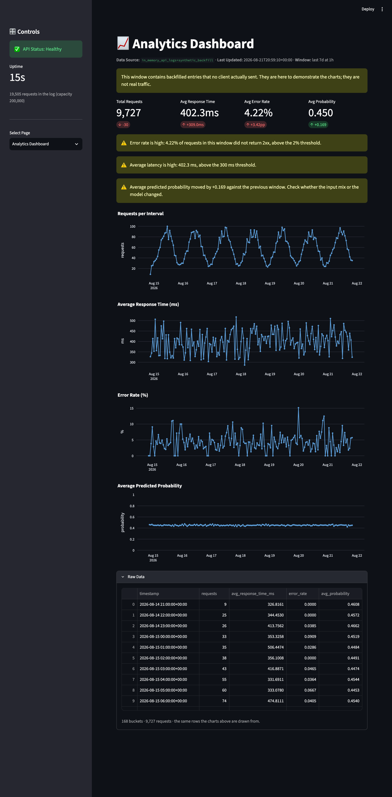

# Analytics Dashboard

[](https://github.com/PSCRedefine/AnalyticsDashboard/actions/workflows/tests.yml)

Traffic and model-output monitoring for the **RankShift Serving** prediction
service: a FastAPI middleware that records every request it serves, two
aggregation endpoints over that log, and a Streamlit page that turns them into
four numbers and four charts.

Built to [docs/SPEC.md](docs/SPEC.md). 101 tests.

*Four of four in [a series](#the-series):*  [Single Prediction](https://github.com/PSCRedefine/SinglePrediction) → [Batch Prediction](https://github.com/PSCRedefine/BatchPrediction) → [Model Info](https://github.com/PSCRedefine/ModelInfo) → **Analytics Dashboard**



---

## Contents

- [The questions it answers](#the-questions-it-answers)
- [Quick start](#quick-start)
- [How the data gets there](#how-the-data-gets-there)
- [Nothing is not zero](#nothing-is-not-zero)
- [Alerts](#alerts)
- [Honesty about the data source](#honesty-about-the-data-source)
- [Repository layout](#repository-layout)
- [Verification](#verification)
- [Limitations](#limitations)
- [The series](#the-series)

---

## The questions it answers

Five, in the order an operator asks them:

- Has the service been called at all?
- Is the call volume going up or down?
- Are responses getting slower?
- Are errors rising?
- Has the model's output distribution shifted?

The first four are ordinary service monitoring. The fifth is the one that makes
this an ML dashboard rather than a web dashboard: a model can be perfectly
healthy by every transport metric while quietly scoring everything at 0.9
because its input mix changed.

## Live demo

A static, interactive capture of the dashboard lives in [`public/index.html`](public/index.html)
and deploys to Vercel with the committed `vercel.json` (framework: none, output
directory `public`). It embeds real responses from `/analytics/summary` and
`/analytics/timeseries` — a healthy week and a degraded one, at three intervals —
and re-implements the page's rendering rules in the browser: same KPI formats,
same alert thresholds (adjustable there), same null handling.

It is a capture, not the service. The live dashboard is two long-running
processes over an in-memory log, which static hosting cannot run; the page says
so. Regenerate it after recapturing with `python scripts/build_demo_page.py`
from `demo/*.json`.

## Quick start

With Docker:

```bash
docker compose up --build
```

Or locally:

```bash
python -m pip install -r requirements-dev.txt
python -m pip install -e .
uvicorn analytics_dashboard.api:app --reload     # terminal 1
streamlit run app.py                              # terminal 2
```

The log lives in memory and starts empty, so the page opens on its empty state.
That is correct, and unhelpful. Fill it with real traffic:

```bash
python scripts/seed_traffic.py --requests 1000
```

A thousand real calls, three per cent of them malformed on purpose so the
error-rate chart has something to draw. For a full week of history — enough for
every KPI card to show a delta — see
[the backfill tool](docs/DEPLOYMENT.md#the-backfill-tool).

## How the data gets there

```text
client ──POST /predict──→ ┌──────────────────────────────────────────┐
                          │ middleware: start the clock              │
                          │   route: score, then write probability   │
                          │          and model_version to            │
                          │          request.state                   │
                          │ middleware: stop the clock, append one   │
                          │             entry (finally)              │
                          └──────────────────┬───────────────────────┘
                                             ▼
                              deque(maxlen=200_000)   ← the only data source
                                             │
              ┌──────────────────────────────┴─────────────────────────┐
              ▼                                                        ▼
     GET /analytics/summary                            GET /analytics/timeseries
     this window · previous · delta                    one row per time bucket
              │                                                        │
              └────────────────────→ app.py (Streamlit) ←──────────────┘
                             4 KPI cards · alerts · 4 charts · Raw Data
```

The middleware has three properties, in priority order: it cannot break a
request (recording is in a `finally`, and the store swallows its own failures);
it counts the failures (a route that raises is logged as a 500 before the
exception continues); and it does not count itself (`/analytics/*` is excluded,
so a dashboard on a wall display does not become the service's busiest client).

`probability` is the interesting field, because the transport layer has no way
to observe it. The route writes it to `request.state`, and the middleware reads
it back after the response exists. Without that handoff the Avg Probability card
has no source.

## Nothing is not zero

The most repeated decision in this codebase, and the one most worth arguing
about.

An empty window has **no** average response time. Reporting `0.0 ms` draws a line
at the bottom of the latency chart that reads as *very fast* rather than
*nothing happened* — and the same trick makes an outage look like a period of
perfect health.

So counts fall back to `0`, averages fall back to `null`, and the page renders
`null` as `-`:



Empty **buckets** are kept rather than dropped, with `requests: 0` and null
averages, because dropping them joins the line straight across the gap and hides
the outage completely. And a delta with no previous window is omitted rather
than shown as `+0` — no comparison and no change are different statements.

`avg_probability` averages only over entries that carry one. A request that
404'd never reached the model; counting it as a zero would turn a client-side
bug into what looks like model degradation.

## Alerts

Three thresholds from the specification: error rate above 2%, average latency
above 300 ms, and an average-probability move of 0.1 or more against the
previous window.



Avg Response Time and Avg Error Rate use inverted delta colours, because up is
bad for both — a rising error rate drawn in green is a dashboard working against
its reader. The error-rate delta is labelled `pp`, not `%`: a move from 1% to 2%
is `+1pp`, and calling it `+1%` makes a doubling read as a rounding error.

**These evaluate the window average**, as specified, which has a blind spot
worth knowing about: a single bad day inside a seven-day window averages out
below both thresholds while being unmistakable in the charts. That is a property
of averaging, not a bug, and it is the reason the charts are on the page and not
just the cards. Discussion in
[docs/ANALYTICS.md](docs/ANALYTICS.md#alert-thresholds-are-window-averages-and-that-has-a-blind-spot).

## Honesty about the data source

The `Data Source` field is not a constant.

`in_memory_api_logs` means every entry in the window came from a request this
service actually served. `in_memory_api_logs+synthetic_backfill` means at least
one did not, and the page renders a warning banner saying so.

That distinction exists because of `scripts/backfill_history.py`, which fills the
days before now with entries no client ever sent so the charts have a week to
draw. Fabricated data is a legitimate demonstration aid; fabricated data that
claims to be real is not. The route is disabled unless
`ANALYTICS_ALLOW_BACKFILL=1`, every entry it writes is flagged, and the flag
propagates all the way to the banner.

A Data Source field that always says the same thing cannot tell you that you are
looking at a demo, which is the only reason to put one on a page.

## Repository layout

```text
app.py                              Streamlit page — no state, no aggregation
src/analytics_dashboard/
  middleware.py                     Records every business request. The feature.
  logstore.py                       Bounded ring buffer, filters, source honesty
  aggregate.py                      Window and bucket arithmetic, HTTP-free
  api.py                            /analytics/summary, /analytics/timeseries, /predict
  features.py                       Feature construction for the prediction route
  config.py                         Capacity, exclusions, thresholds, paths
scripts/
  seed_traffic.py                   Real calls, so the log has real entries
  backfill_history.py               Synthetic history, flagged as such
tests/                              101 tests
docs/
  SPEC.md                           The specification this was built to
  TRACEABILITY.md                   Every requirement → implementation → evidence
  API.md                            Endpoint reference
  ANALYTICS.md                      The decisions and their reasoning
  DEPLOYMENT.md                     Docker, configuration, operating notes
  PRODUCTION_READINESS.md           What it would need to carry real traffic
```

## Verification

```bash
python -m pytest -q
```

101 tests, no network. The aggregation tests build log entries at controlled
timestamps — real traffic cannot exercise a seven-day window, because every call
you make lands in the same minute. The middleware tests go the other way and use
the real service, because a middleware is a claim about what happens around a
request and the only way to check it is to make one.

One test earns its place above the others:
`test_the_summary_total_matches_the_sum_of_the_buckets`. A page whose KPI card
disagrees with its own chart is worse than no page.

## Limitations

This section lists what is known to be missing or imperfect in what was built.
A wider account — what this service would need before it carries real traffic,
ordered by risk, with the cost of each remedy — is in
[docs/PRODUCTION_READINESS.md](docs/PRODUCTION_READINESS.md).

- **The log does not survive a restart.** A deploy resets the dashboard to its
  empty state. This is what an in-memory deque honestly is.
- **It is per process.** Two uvicorn workers hold two disjoint logs and the page
  shows whichever answered, so the compose file pins `--workers 1`. Lifting that
  means moving the log out of process — Redis, a time-series database, a log
  pipeline — which is a different system.
- **Bounded at 200,000 entries**, about 40 MB. Past that the oldest falls out.
  `/health` reports the headroom.
- **Alerts are window averages.** See above.
- **No filter controls on the page.** The API supports `endpoint`,
  `model_version` and `status_code_family`; the specification asks for no UI for
  them, so there is none. They work from `curl` today.
- **`avg_probability` mixes endpoints.** Every logged probability is averaged
  together. With one prediction route that is exact; add a second and the chart
  becomes a blend until you filter by `endpoint`.

---

## The series

Four repositories, read in this order, are one product line: score one, score
many, check what is deployed, then watch it in production.

1. [Single Prediction](https://github.com/PSCRedefine/SinglePrediction) — one prediction per request — feature selection, model choice, calibration and the operating point
2. [Batch Prediction](https://github.com/PSCRedefine/BatchPrediction) — up to 100 rows per call, with per-row fault isolation
3. [Model Info](https://github.com/PSCRedefine/ModelInfo) — what is actually loaded in memory, and what that tells you
4. **Analytics Dashboard** *(you are here)* — traffic and model-output monitoring over a request log

Each repository runs on its own. The cost of that is stated plainly in each
Limitations section: `features.py`, the API skeleton and the model artefact
are duplicated across all four.
